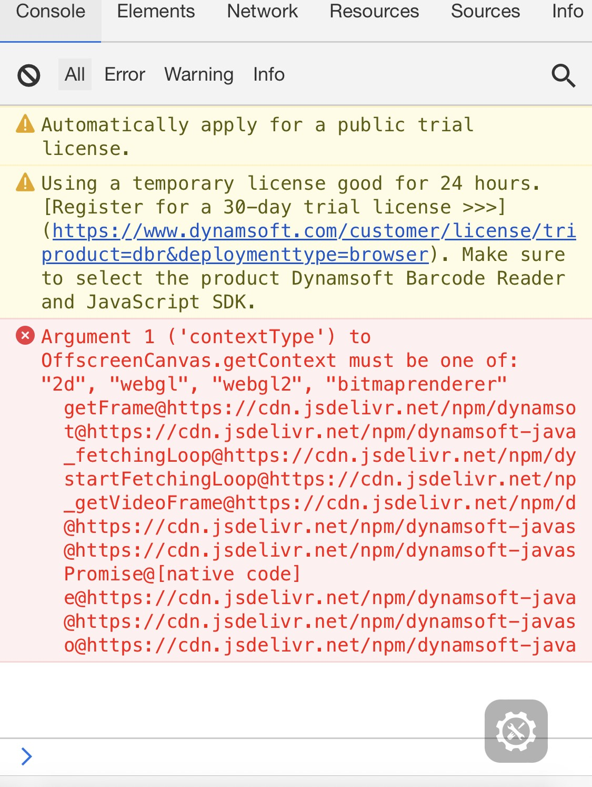

# Why Javascript SDK does not pick up barcodes on iOS 16.4?

[<< Back to FAQ index](index.md)

## Background

iOS 16.4 was published on March 27th, 2023. In this version, all browsers on iOS have begun to support `OffscreenCanvas`. Unfortunately, Apple's implementation of the API is still incomplete and is missing the important feature "webgl context". Read more on [OffscreenCanvas](https://developer.mozilla.org/en-US/docs/Web/API/OffscreenCanvas)
 
## Impact

We used `OffscreenCanvas` in old versions of DBR JS. Specifically in versions **7.5.0 ~ 8.8.7**. However, we used an alternative of the API beginning in v9.0.0. Therefore, all 9+ versions are not affected. 

If you encounter the issue, you will see the following error in the browser console:


 
## Solution:
 
There are three solutions to the issue:

### Option 1: Disable the API directly before creating a `BarcodeScanner` instance

```js
window.OffscreenCanvas = null;
let scanner = await Dynamsoft.DBR.BarcodeScanner.createInstance();
//...
```

> NOTE:
> 
> If the user uses `OffscreenCanva`s themselves or other libraries on the same page need to use `OffscreenCanvas`, then this approach will break them!

### Option 2: Disable webgl context usage in DBR JS

If you are not sure whether `OffscreenCanvas` can be disabled globally as suggested in Option 1, you can change a setting of the instance after creating the `BarcodeScanner` instance to go around the issue.

```js
let scanner = await Dynamsoft.DBR.BarcodeScanner.createInstance();
scanner.ifSaveOriginalImageInACanvas = true;
//...
```

> NOTE
> 
> This approach may slow DBR JS down a little bit, but the difference can be ignored on devices capable of running iOS 16.4.
 
### Option 3: Upgrade to the latest v9.x version

If it is convenient, we recommend that you upgrade to the latest v9.x version to avoid the issue. Please refer to the [upgrade guide](https://www.dynamsoft.com/barcode-reader/docs/web/programming/javascript/upgrade-guide/?ver=latest).

If none of the options work for you, please [contact us](https://www.dynamsoft.com/company/contact/).
