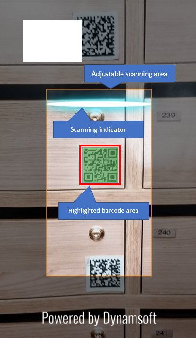

# Dynamsoft Barcode Reader for JavaScript - Introduction

This version of Dynamsoft Barcode Reader (hereinafter referred to as "the library") is based on JavaScript and WebAssembly and can run in all major modern browsers on all major platforms. It is ideal for 

* Organizations who already have sophisticated websites and do not intend to develop mobile applications for the same purposes;
* Organizations whose customers have no desire to install applications for temporary usage of their services.

## Fast Integration

With the library integrated, end users can open the web page in a browser, access their cameras and read barcodes directly from the video input. The integration can be done with just a few lines of code and without the hassle of installing anything.

``` html
<script src="https://cdn.jsdelivr.net/npm/dynamsoft-javascript-barcode@8.4.0/dist/dbr.js"></script>
<script>
    let scanner = await Dynamsoft.DBR.BarcodeScanner.createInstance();
    scanner.onUnduplicatedRead = (txt, result) => {
        // Do somthing with the "txt" found in the barcode
    };
    await scanner.show();
</script>
```

The above lines of code has completed the integration of the library into a web page and this is made possible with the following two features.

### Built-in Camera Control

Customers generally need to scan a barcode on the fly at which time there is no better input than the camera hooked to or built into the device itself. The library uses the powerful **MediaDevices** interface (provided by the browser itself) to instantly connect the video input of the camera with the back-end decoding engine.

### Interactive UI

Good interaction design is essential for a website, the same is true for SDKs such as the library. As shown in the screenshot below, the library streams the video on the page, guides the user where to aim and highlights the areas where barcodes are found.



> NOTE: 
> 
> When the client opens the page, the library is immediately initialized in the background, which takes a few seconds to complete. By the time the customer is asked to scan a barcode, the library will already be ready.

## High Performance

Barcode reading is usually just an auxiliary way to assist a small step in a complex workflow. Customers like the convenience, but if it takes too long or is error-prone, their patience will quickly run out. Therefore, high performance is crucial.

### Unparalleled Speed

The library showcases Dynamsoft’s cutting-edge technology in light-speed recognition of barcodes. In most cases, an image gets deblurred, binarized and read under 100 milliseconds. 

<!--TODO

add more info (APIs, etc.) on how we achieve better speed

-->

### Proficiency in Handling Difficult Environments

The actual use environment is unpredictable. The barcode may appear distorted, inverted, or partially damaged; the background may be textured or spotted; the light may be very low, and there may be shadows and glare. The library handles all these cases with its rich image processing algorithms through various adjustable settings.

<!--TODO

add more info (APIs, etc.) on how we handle these tough codes

-->

### Exceptional Accuracy

The library does a lot of preparation work to make sure the barcode is as legible as possible for the decoding engine to read. This ensures a very high accuracy. In addition, the library achieves even higher accuracy through the following ways:

* The library has a confidence score for each recognition which can be used to filter unwanted results;
* In the case of continuous scanning, the library compares the results of multiple consecutive recognitions and return only the results confirmed by at least two efforts.

Through many experiences, the library has also cultivated its error correction ability against barcodes which do not strictly abide by the specification as well as deformed barcodes caused by improper printing.

## Usage Scenarios

The library is designed for websites. Common usage scenarios include:

### Retail

Most if not all products on the market now have barcodes on their packaging. Customers can scan the barcode to place an order, register a product for post-sales service or just trace the product to its origin.

### ID Scanning

All driver’s licenses issued in the USA and Canada by the American Association of Motor Vehicle Administrators (AAMVA) have a PDF417 Barcode on them. The information encoded in the Barcode follows the DL/ID Card Design Standard (CDS) and can be easily parsed to meaningful form fields.

Other ID cards that come with barcodes include the Permanent Account Number (PAN) Card in India, Driver’s license in South Africa, etc.

### VIN Scanning

Every vehicle has its own Vehicle Identification Number (VIN). When printing the number on the vehicle, many manufacturers also print a barcode alongside it. Customers can scan the barcode to register for an insurance claim or look up vehicle information like maintenance records, mileage rollbacks, etc.

### Inventory Management

Inventory management is a highly stressful and arduous process where both efficiency and accuracy are crucial. Customers can use the library to scan multiple items at the same time which greatly boosts efficiency.

## See Also

### User Guide

For a fast start, read the [User Guide](user-guide/).

### Demo and Samples

To see the library in action, check out the [Demo and Samples](sample-index.md)

### API Reference

For a overview of the APIs, see the [API Reference](api-reference/).

### Release Notes

For a peek of the library history, check the [Release Notes](release-notes/).

### Acquire Licenses

Interested to acquire a license? Visit our <a href="https://www.dynamsoft.com/store/dynamsoft-barcode-reader/#JavaScript" target="_blank">Online Store</a>.
