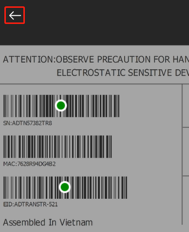
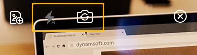
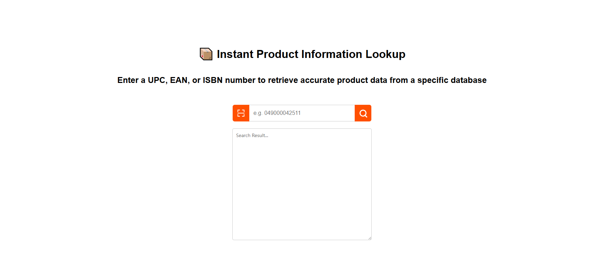

# Release Notes for Dynamsoft Barcode Reader JavaScript SDK

## 11.2.4000 (11/11/2025)

### Fixed

- Fixed a bug that could cause a crash when using model localization with a 2D barcode.

## 11.2.2000 (11/04/2025)

### ✨ Key Highlights
#### AI-Powered Barcode Detection and Decoding

- New Localization Models – Introduces [`OneDLocalization`]({{ site.dcvb_parameters }}barcode-reader-task-settings/localization-modes.html#modelnamearray) and [`DataMatrixQRCodeLocalization`]({{ site.dcvb_parameters }}barcode-reader-task-settings/localization-modes.html#modelnamearray) neural network models for improved detection of **blurred / low-resolution 1D codes**, or **partially damaged DataMatrix/QR codes**.
- Specialized Decoders – Adds [`EAN13Decoder`]({{ site.dcvb_parameters }}barcode-reader-task-settings/deblur-modes.html#modelnamearray) and [`Code128Decoder`]({{ site.dcvb_parameters }}barcode-reader-task-settings/deblur-modes.html#modelnamearray) models optimized for **long-distance** and **motion-blurred** decoding scenarios.
- Redesigned Deblur Model – The [`OneDDeblur`]({{ site.dcvb_parameters }}barcode-reader-task-settings/deblur-modes.html#modelnamearray) model now provides more effective recovery from **motion and focus blur**.
- Configurable Model Selection – The new `ModelNameArray` parameter supports flexible model loading and fine-grained control for specific barcode types.

#### Precision and Processing Control

- Enhanced Deblur Methods – [`DM_DEEP_ANALYSIS`]({{ site.dcvb_parameters }}barcode-reader-task-settings/deblur-modes.html#dm_deep_analysis) now includes sub-level control with `OneDGeneral`, `TwoDGeneral`, and `EAN13Enhanced` options.
- Barcode Count Expectation – The new [`ExpectedBarcodesCount`]({{ site.dcvb_parameters }}barcode-format-specification/expected-barcodes-count.html) parameter enables **format-specific quantity control** and **early termination** in fixed-count workflows.
- Improved Region Detection – The new [`RPM_GRAY_CONSISTENCY`]({{ site.dcvb_parameters }}image-parameter/region-predetection-modes.html#rpm_gray_consistency) mode provides more precise region extraction based on **grayscale uniformity** and **local consistency** for document and label processing.

### Performance Highlights

- Up to **26.5%** higher read rates under blur conditions with as much as **44%** faster processing.
- Reliable decoding of DataMatrix and QR codes with missing or damaged finder patterns.
- Extended operational range beyond 75 cm for long-distance barcode scanning.

### Developer Notes

- Backward Compatibility – Fully compatible with existing integrations; no code-level changes required for upgrade.
- Configuration Flexibility – Expanded parameter set allows comprehensive model configuration for scenario-specific tuning.
- Production Stability – All new models validated in enterprise environments.

#### Updates for [BarcodeScanner](https://dynamsoft.com/barcode-reader/docs/web/programming/javascript/api-reference/barcode-scanner.html)

- In **single** mode, if the target barcode is not found among the candidates, there is now an opportunity to rescan.  
  
- Fixed an issue where the barcode location could be inaccurate in certain cases.  
- Fixed a problem where, in specific cases when the camera was occupied, the video stream could not be displayed correctly.  
- Other known issues fixed.  

#### Engineering Optimizations

- Optimized the parallel download logic to improve resource loading speed.  
- Optimized [adaptive WASM loading logic](../faq/adaptive-wasm-loading.md) to further enhance performance in modern browser environments.  

### API Changes

#### New

- Added the `switchCapturingTemplate()` method to the `CaptureVisionRouter` class to enable switching the active capturing template during the image processing workflow. 
- Added methods `toBlob()`, `toImage()`, and `toCanvas()` to the `originalImageResultItem` interface for flexible image data conversion.
- Added the `SetGlobalIntraOpNumThreads()` method to the `CaptureVisionRouter` class to configure the global thread count for model inference.  
- Added the `clearDLModelBuffers()` method to the `CaptureVisionRouter` class to manually release memory occupied by loaded models.  
- Added callback functions `onSpecLoadProgressChanged()` and `onWasmLoadProgressChanged()` to monitor resource loading progress.  
- Added the `convertToContainCoordinates()` method to the `CameraEnhancer` class to convert coordinates from `fit: cover` to `fit: contain` mode.  
- Added the `LM_NEURAL_NETWORK` enumeration to `EnumLocalizationMode`.  

#### Updated

- Changed the default value of `MaxThreadsInOneTask` from **4** to **0**.  
- Changed the default value of `IncludeTrailingCheckDigit` from **1** to **0**.  

#### Deprecated

- Deprecated the `DeblurModelNameArray` argument in the `DeblurModes` parameter. Use `ModelNameArray` instead.  
- Deprecated the `appendModelBuffer()` method in the `CaptureVisionRouter` class. Use `appendDLModelBuffer()` instead.  

## 11.0.6000 (08/14/2025)

### New

- Introduced new samples:

  - [`Pick One to Fill`](https://github.com/Dynamsoft/barcode-reader-javascript-samples/tree/main/scenarios/pick-one-to-fill/index.html) - [run↗](https://demo.dynamsoft.com/samples/dbr/js/scenarios/pick-one-to-fill/index.html?utm_source=sampleReadme): Pick one and auto-fill fields by simply opening the camera and scanning a group of barcodes.
  - [`Batch Inventory`](https://github.com/Dynamsoft/barcode-reader-javascript-samples/blob/main/scenarios/batch-inventory/index.html) - [run↗](https://demo.dynamsoft.com/samples/dbr/js/scenarios/batch-inventory/index.html?utm_source=sampleReadme): An inventory management tool scan barcodes in batches and provide real-time analysis of the scanned data.
  - [`Read and Parse GS1-AI`](https://github.com/Dynamsoft/barcode-reader-javascript-samples/tree/main/scenarios/read-and-parse-GS1-AI/scan-using-rtu-api/index.html) - [run↗](https://demo.dynamsoft.com/samples/dbr/js/scenarios/read-and-parse-GS1-AI/scan-using-rtu-api/index.html?utm_source=sampleReadme): Read GS1 Application Identifier (AI) barcode and parse its structured data.

- Template Version Validation: Introduced version checking for templates to prevent compatibility issues and mismatches.

### Changed

- License Validation Behavior: Instead of stopping execution immediately on an invalid license module, the library now continues processing and returns results from modules with valid licenses. An warning is still reported to indicate the license issue.

### Fixed

- Fixed various minor bugs and improved overall stability.

## 11.0.3000 (07/09/2025)

### [Highlights](https://www.dynamsoft.com/release-highlights/?product=dcv3.0)

#### Workflow Improvements

- Restructured the parameter control hierarchy at all levels for finer scope definition and more granular process management, with the stage level newly added.
  
#### Deep Learning Integration

- Improved the reading rate of 1D barcode by introducing a new deblurring deep-learning model.

#### Algorithm Enhancements

- Enabled deduplication at the Region of Interest (ROI) level to consolidate results from multiple tasks.
- Improved the `CODE_128` and `DataMatrix` DeepAnalysis algorithms for better decoding accuracy and performance.
- Added support for new barcode types: `CODE_32`, `MATRIX_25`, `KIX`, and `TELEPEN`.
- Added GS1 Application Identifiers (AI) support for improved code parsing capabilities.

#### Engineering Optimizations

- Simplified the loading and configuration of WASM resources, reducing the overall size of the WASM files.

#### Updates for [BarcodeScanner](https://dynamsoft.com/barcode-reader/docs/web/programming/javascript/api-reference/barcode-scanner.html)

- Added several new UI controls (not displayed by default).

- Introduced a new `"Scan and Search"` sample to simulate searching for relevant data via barcodes. [Give it a try!](https://demo.dynamsoft.com/Samples/DBR/JS/scenarios/scan-and-search/scan-and-search.html)

- Added the `customHighlightForBarcode` API to easily customize highlights on detected barcodes.
- Updated default values for certain parameters:
  - The close button is now shown by default.
  - The `resultView` is now shown by default for `multi_unique` mode.
- Improved deduplication and billing logic for more accurate count tracking.
- Minor bug fixes and performance improvements.
