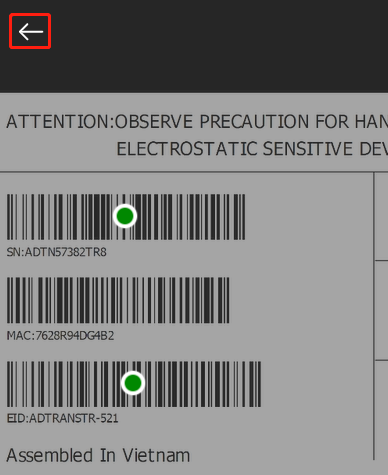
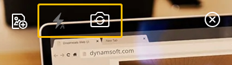
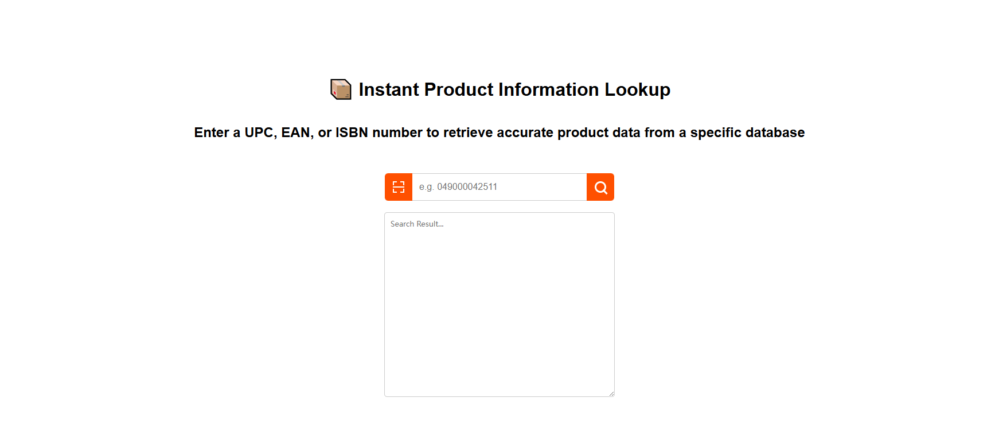

# Release Notes for Dynamsoft Barcode Reader JavaScript SDK

## 11.4.2001 (04/24/2026)

### Fixed

- Fixed an issue where coordinate conversion could behave abnormally after large images were compressed.
- Fixed an issue where abnormal DCEFrame `imageData` could cause errors in the `toCanvas()` method.

### improved

- Optimized the behavior of the Dynamsoft Camera Enhancer torch and other camera-related features.

## 11.4.2000 (04/21/2026)

### ⚠️ Roadmap notice: Foundational API Becomes Primary

Starting with this release, the **Foundational API** (`CaptureVisionRouter` and related classes) is officially the primary and recommended integration path for DBR-JS. `BarcodeScanner` transitions to the role of an **officially maintained simplified wrapper**.

**What this means in practice:**

- **v11 (current)** – No breaking changes. `BarcodeScanner` continues to work exactly as before and will receive maintenance updates and bug fixes for the entire v11 lifecycle.
- **v12 (future)** – `BarcodeScanner` will no longer be bundled as part of the main `dynamsoft-barcode-reader-bundle` package. It will be distributed separately but will still be officially supported.

**Why this change:**

- **Foundational scales; the wrapper doesn't.** When projects move beyond basic demos — integrating other DCV components (document detection, label recognition), or building production workflows — `BarcodeScanner` hits a wall. Developers may end up rebuilding on the Foundational API.
- **One clear path, not two.** Two parallel API surfaces create confusion at evaluation time — for developers and for the AI coding assistants they increasingly use. A single recommended path simplifies onboarding.
- **AI tools close the boilerplate gap.** Much of `BarcodeScanner`'s value was fewer lines of code. With AI-assisted coding now common, developers can scaffold Foundational API code just as quickly.

**Recommended action for new projects:** Build on the Foundational API to ensure forward compatibility. See the [Foundational API Guide](../user-guide/index.html) for a full walkthrough.

**Existing projects using `BarcodeScanner`:** The wrapper will continue to receive long-term support. No action required for v11. When v12 is released, a guide will be provided for migrating to the Foundational API or continuing to use the wrapper.

### Highlights

#### AI-Powered Barcode Detection and Decoding

- **PDF417 Localization Model** – Introduces the [`PDF417Localization`]({{ site.dcvb_parameters }}barcode-reader-task-settings/localization-modes.html#modelnamearray) neural network model for improved detection of PDF417 barcodes, especially under challenging conditions.

- **Code39/ITF Decoding Model** – Adds the [`Code39ITFDecoder`]({{ site.dcvb_parameters }}barcode-reader-task-settings/deblur-modes.html#modelnamearray) model for enhanced decoding of Code 39 and ITF barcodes under blurred or low-resolution conditions.

- **Deblur Models for 2D Barcodes** – Adds the [`DataMatrixQRCodeDeblur`]({{ site.dcvb_parameters }}barcode-reader-task-settings/deblur-modes.html#modelnamearray) and [`PDF417Deblur`]({{ site.dcvb_parameters }}barcode-reader-task-settings/deblur-modes.html#modelnamearray) models to provide more effective recovery from motion and focus blur for DataMatrix, QR Code, and PDF417 barcodes.

#### ECI (Extended Channel Interpretation) Support

- **ECI Information Return** – Adds support for retrieving Extended Channel Interpretation (ECI) data from barcodes. The new [`ECISegment`]({{ site.js_api }}/interfaces/eci-segment.html) interface, along with the `eciSegments` property in the [`BarcodeResultItem`]({{ site.js_api }}/interfaces/barcode-result-item.html#ecisegments) and [`DecodedBarcodeElement`]({{ site.js_api }}/interfaces/decoded-barcode-element.html#ecisegments) interfaces, enables access to character encoding information embedded in barcodes.

- **ECI-Based Text Interpretation** – Adds support for interpreting ECI segments during barcode decoding, improving compatibility with international character sets.

#### Performance Improvements

- **On-Demand Model Loading** – Implements lazy loading for AI models, reducing initialization time by loading models only when first needed.

- **Smart Model Selection** – Models are now loaded based on configured barcode formats, minimizing memory usage by excluding unused models.

- **Improved Confidence Scoring** – Enhances confidence score calculation for results from neural network models, providing more accurate quality indicators.

- **DPM Barcode Optimization** – Improves recognition rate for Direct Part Marking (DPM) barcodes commonly used in industrial and manufacturing environments.

### API Changes

#### New

- Added [`BarcodeZoneWidthToHeightRatioRangeArray`]({{ site.dcvb_parameters }}barcode-format-specification/barcode-zone-width-to-height-ratio-range-array.html) parameter for filtering barcodes based on aspect ratio constraints.

- Added [`SetResultCrossVerificationCriteria()`]({{ site.dcvb_js_api }}utility/multi-frame-result-cross-filter.html#setresultcrossverificationcriteria) and [`GetResultCrossVerificationCriteria()`]({{ site.dcvb_js_api }}utility/multi-frame-result-cross-filter.html#getresultcrossverificationcriteria) methods to `MultiFrameResultCrossFilter` for configurable multi-frame result verification.

- Added [`AuxiliaryRegionElement`]({{ site.dcvb_js_api }}core/intermediate-results/auxiliary-region-element.html) class for representing additional region information detected during processing (e.g., MRZ (Machine Readable Zone), portrait zones).

- Added `ROET_AUXILIARY_REGION` to [`RegionObjectElementType`]({{ site.dcvb_js_api }}core/enum-region-object-element-type.html) enumeration for the new `AuxiliaryRegionElement` class.

#### Changed

- Barcode text encoding fallback changed from UTF-8 to ISO-8859-1 when no ECI information is present in the barcode.

- All methods under the [`ImageProcessor`]({{ site.dcvb_js_api }}utility/image-processor.html) class now additionally accept [`DSImageData`]({{ site.dcvb_js_api }}core/basic-structures/ds-image-data.html) as an image input type.

- All methods under the [`ImageIO`]({{ site.dcvb_js_api }}utility/image-io.html), [`ImageProcessor`]({{ site.dcvb_js_api }}utility/image-processor.html), and [`ImageDrawer`]({{ site.dcvb_js_api }}utility/image-drawer.html) classes have been changed to static methods.

- [`CodeParserModule.loadSpec()`]({{ site.dcp_js_api }}code-parser-module-class.html#loadspec) now returns a `Promise<ErrorInfo>` instead of `void`.

- Updated default value of `compensation` parameter in [`convertToBinaryLocal()`]({{ site.dcvb_js_api }}utility/image-processor.html#converttobinarylocal) from 0 to 10.

- [`convertToBinaryGlobal()`]({{ site.dcvb_js_api }}utility/image-processor.html#converttobinaryglobal) and [`convertToBinaryLocal()`]({{ site.dcvb_js_api }}utility/image-processor.html#converttobinarylocal) of `ImageProcessor` class now support color, binary and grayscale images as input.

- Parser resource files (.json) have been consolidated into encrypted .data files for improved security and simplified distribution:
  - `AADHAAR.data`, `AAMVA_DL_ID.data`, `GS1_AI.data`, `MRTD.data`, `SOUTH_AFRICA_DL.data`, `VIN.data`

- `CameraEnhancer.open()` now returns `Promise<void>` when operating in `singleFrameMode`.

#### Removed

- Removed `DataMatrixModuleIsotropic` parameter – use [`BarcodeZoneWidthToHeightRatioRangeArray`]({{ site.dcvb_parameters }}barcode-format-specification/barcode-zone-width-to-height-ratio-range-array.html) instead.

- Removed `MinRatioOfBarcodeZoneWidthToHeight` parameter – use [`BarcodeZoneWidthToHeightRatioRangeArray`]({{ site.dcvb_parameters }}barcode-format-specification/barcode-zone-width-to-height-ratio-range-array.html) instead.

### Fixed

- Fixed incorrect coordinate in barcode result when using neural network models with a specified region.

- Fixed crash and hang issues that could occur in certain scenarios.

- Fixed various minor bugs and improved overall stability.

## 11.2.4000 (11/11/2025)

### Fixed

- Fixed a bug that could cause a crash when using model localization with a 2D barcode.

## 11.2.2000 (11/04/2025)

### Highlights
#### AI-Powered Barcode Detection and Decoding

- New Localization Models – Introduces [`OneDLocalization`]({{ site.dcvb_parameters }}barcode-reader-task-settings/localization-modes.html#modelnamearray) and [`DataMatrixQRCodeLocalization`]({{ site.dcvb_parameters }}barcode-reader-task-settings/localization-modes.html#modelnamearray) neural network models for improved detection of **blurred / low-resolution 1D codes**, or **partially damaged DataMatrix/QR codes**.
- Specialized Decoders – Adds [`EAN13Decoder`]({{ site.dcvb_parameters }}barcode-reader-task-settings/deblur-modes.html#modelnamearray) and [`Code128Decoder`]({{ site.dcvb_parameters }}barcode-reader-task-settings/deblur-modes.html#modelnamearray) models optimized for **long-distance** and **motion-blurred** decoding scenarios.
- Redesigned Deblur Model – The [`OneDDeblur`]({{ site.dcvb_parameters }}barcode-reader-task-settings/deblur-modes.html#modelnamearray) model now provides more effective recovery from **motion and focus blur**.
- Configurable Model Selection – The new `ModelNameArray` parameter supports flexible model loading and fine-grained control for specific barcode types.

#### Precision and Processing Control

- Enhanced Deblur Methods – [`DM_DEEP_ANALYSIS`]({{ site.dcvb_parameters }}barcode-reader-task-settings/deblur-modes.html#dm_deep_analysis) now includes sub-level control with `OneDGeneral`, `TwoDGeneral`, and `EAN13Enhanced` options.
- Barcode Count Expectation – The new [`ExpectedBarcodesCount`]({{ site.dcvb_parameters }}barcode-format-specification/expected-barcodes-count.html) parameter enables **format-specific quantity control** and **early termination** in fixed-count workflows.
- Improved Region Detection – The new [`RPM_GRAY_CONSISTENCY`]({{ site.dcvb_parameters }}image-parameter/region-predetection-modes.html#rpm_gray_consistency) mode provides more precise region extraction based on **grayscale uniformity** and **local consistency** for document and label processing.

### Performance Highlights

- Up to **26.5%** higher read rates under blur conditions with as much as **44%** faster processing.
- Reliable decoding of DataMatrix and QR codes with missing or damaged finder patterns.
- Extended operational range beyond 75 cm for long-distance barcode scanning.

### Developer Notes

- **Backward Compatibility** – Fully compatible with existing integrations; no code-level changes required for upgrade.
- **Configuration Flexibility** – Expanded parameter set allows comprehensive model configuration for scenario-specific tuning.
- **Production Stability** – All new models validated in enterprise environments.

#### Engineering Optimizations

- Optimized the parallel download logic to improve resource loading speed.  
- Optimized [adaptive WASM loading logic](../faq/adaptive-wasm-loading.md) to further enhance performance in modern browser environments.  

### API Changes

#### New

- Added the `switchCapturingTemplate()` method to the `CaptureVisionRouter` class to enable switching the active capturing template during the image processing workflow. 
- Added methods `toBlob()`, `toImage()`, and `toCanvas()` to the `originalImageResultItem` interface for flexible image data conversion.
- Added the `SetGlobalIntraOpNumThreads()` method to the `CaptureVisionRouter` class to configure the global thread count for model inference.  
- Added the `clearDLModelBuffers()` method to the `CaptureVisionRouter` class to manually release memory occupied by loaded models.  
- Added callback functions `onSpecLoadProgressChanged()` and `onWasmLoadProgressChanged()` to monitor resource loading progress.  
- Added the `convertToContainCoordinates()` method to the `CameraEnhancer` class to convert coordinates from `fit: cover` to `fit: contain` mode.  
- Added the `LM_NEURAL_NETWORK` enumeration to `EnumLocalizationMode`.  

#### Updated

- Changed the default value of `MaxThreadsInOneTask` from **4** to **0**.  
- Changed the default value of `IncludeTrailingCheckDigit` from **1** to **0**.  

#### Deprecated

- Deprecated the `DeblurModelNameArray` argument in the `DeblurModes` parameter. Use `ModelNameArray` instead.  
- Deprecated the `appendModelBuffer()` method in the `CaptureVisionRouter` class. Use `appendDLModelBuffer()` instead.

#### BarcodeScanner Wrapper Updates

- In **single** mode, if the target barcode is not found among the candidates, there is now an opportunity to rescan.
  
- Fixed an issue where the barcode location could be inaccurate in certain cases.
- Fixed a problem where, in specific cases when the camera was occupied, the video stream could not be displayed correctly.
- Other known issues fixed.

## 11.0.6000 (08/14/2025)

### New

- Introduced new samples:

  - [`Pick One to Fill`](https://github.com/Dynamsoft/barcode-reader-javascript-samples/tree/main/scenarios/pick-one-to-fill/index.html) - [run↗](https://demo.dynamsoft.com/samples/dbr/js/scenarios/pick-one-to-fill/index.html?utm_source=sampleReadme): Pick one and auto-fill fields by simply opening the camera and scanning a group of barcodes.
  - [`Batch Inventory`](https://github.com/Dynamsoft/barcode-reader-javascript-samples/blob/main/scenarios/batch-inventory/index.html) - [run↗](https://demo.dynamsoft.com/samples/dbr/js/scenarios/batch-inventory/index.html?utm_source=sampleReadme): An inventory management tool scan barcodes in batches and provide real-time analysis of the scanned data.
  - [`Read and Parse GS1-AI`](https://github.com/Dynamsoft/barcode-reader-javascript-samples/tree/main/scenarios/read-and-parse-GS1-AI/scan-using-rtu-api/index.html) - [run↗](https://demo.dynamsoft.com/samples/dbr/js/scenarios/read-and-parse-GS1-AI/scan-using-rtu-api/index.html?utm_source=sampleReadme): Read GS1 Application Identifier (AI) barcode and parse its structured data.

- Template Version Validation: Introduced version checking for templates to prevent compatibility issues and mismatches.

### Changed

- License Validation Behavior: Instead of stopping execution immediately on an invalid license module, the library now continues processing and returns results from modules with valid licenses. A warning is still reported to indicate the license issue.

### Fixed

- Fixed various minor bugs and improved overall stability.

## 11.0.3000 (07/09/2025)

### [Highlights](https://www.dynamsoft.com/release-highlights/?product=dcv3.0)

#### Workflow Improvements

- Restructured the parameter control hierarchy at all levels for finer scope definition and more granular process management, with the stage level newly added.
  
#### Deep Learning Integration

- Improved the reading rate of 1D barcode by introducing a new deblurring deep-learning model.

#### Algorithm Enhancements

- Enabled deduplication at the Region of Interest (ROI) level to consolidate results from multiple tasks.
- Improved the `CODE_128` and `DataMatrix` DeepAnalysis algorithms for better decoding accuracy and performance.
- Added support for new barcode types: `CODE_32`, `MATRIX_25`, `KIX`, and `TELEPEN`.
- Added GS1 Application Identifiers (AI) support for improved code parsing capabilities.

#### Engineering Optimizations

- Simplified the loading and configuration of WASM resources, reducing the overall size of the WASM files.

#### BarcodeScanner Wrapper Updates

- Added several new UI controls (not displayed by default).

- Introduced a new `"Scan and Search"` sample to simulate searching for relevant data via barcodes. [Give it a try!](https://demo.dynamsoft.com/Samples/DBR/JS/scenarios/scan-and-search/scan-and-search.html)

- Added the `customHighlightForBarcode` API to easily customize highlights on detected barcodes.
- Updated default values for certain parameters:
  - The close button is now shown by default.
  - The `resultView` is now shown by default for `multi_unique` mode.
- Improved deduplication and billing logic for more accurate count tracking.
- Minor bug fixes and performance improvements.
