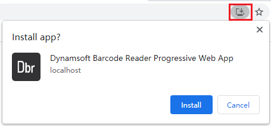

# JavaScript Hello World Sample - PWA

[PWA](https://web.dev/progressive-web-apps/) is short for Progressive Web Apps which stand for web applications that have been designed to behave like platform-specific (native) applications. Check out the following on how to implement Dynamsoft Barcode Reader JavaScript SDK (hereafter called "the library") into a PWA application.

## Official Sample

* <a target = "_blank" href="https://demo.dynamsoft.com/Samples/DBR/JS/1.hello-world/10.read-video-pwa/helloworld-pwa.html">Hello World in PWA - Demo</a>
* <a target = "_blank" href="https://github.com/Dynamsoft/barcode-reader-javascript-samples/tree/main/1.hello-world/10.read-video-pwa">Hello World in PWA - Source Code</a>

## Preparation

We will try to turn our most basic hello world sample into a PWA. 

First, create a file with the name "helloworld-pwa.html" and fill it with the following code:

```html
<!DOCTYPE html>
<html lang="en">

<head>
    <meta charset="utf-8">
    <meta name="viewport" content="width=device-width,initial-scale=1.0">
    <title>Dynamsoft Barcode Reader Sample - Hello World (Decoding via Camera)</title>
    <script src="https://cdn.jsdelivr.net/npm/dynamsoft-javascript-barcode@9.0.2/dist/dbr.js"></script>
</head>

<body>
    <h2>Minimum Code to Read Barcodes</h2>
    <button id='readBarcode'>Read Barcode via Camera</button>
    <script>
        let pScanner = null;
        let latestResult = null;
        Dynamsoft.DBR.BarcodeReader.license = 'DLS2eyJvcmdhbml6YXRpb25JRCI6IjIwMDAwMSJ9';
        document.getElementById('readBarcode').onclick = async function() {
            try {
                let scanner = await (pScanner = pScanner || Dynamsoft.DBR.BarcodeScanner.createInstance());
                scanner.onFrameRead = results => {
                    console.log("Barcodes on one frame:");
                    for (let result of results) {
                        console.log(result.barcodeFormatString + ": " + result.barcodeText);
                    }
                };
                scanner.onUniqueRead = (txt, result) => {
                    latestResult = txt;
                    console.log("Unique Code Found: " + result);
                }
                await scanner.show();
            } catch (ex) {
                alert(ex.message);
                throw ex;
            }
        };
    </script>
</body>

</html>
```

Next, set up a secure environment (HTTPs) to run the page "helloworld-pwa.html". This is required because PWAs only run in secure environments.

In our case, we use IIS to set up a secure site at "https://localhost" and the page is put at the root so that it can be accessed at "https://localhost/helloworld-pwa.html".

## Make the app progressive

### Register a service worker for offline support

As the basis for PWAs, Service Workers are a virtual proxy between the browser and the network. A service worker can serve content offline, handle notifications and perform heavy calculations, etc. all on a separate thread.

To use a service worker, we first need to register it. In the helloworld-pwa.html file, add the following at the end of the script:

```javascript
if ('serviceWorker' in navigator) {
    navigator.serviceWorker.register('./service-worker.js');
};
```

Create the service-worker.js file with the following content:

```javascript
// Files to cache
const cacheName = 'helloworld-pwa';
const appShellFiles = [
    '/helloworld-pwa.html',
];

// Installing Service Worker
self.addEventListener('install', (e) => {
    console.log('[Service Worker] Install');
    e.waitUntil((async () => {
        const cache = await caches.open(cacheName);
        console.log('[Service Worker] Caching all: app shell and content');
        await cache.addAll(appShellFiles);
    })());
});

self.addEventListener('fetch', (e) => {
    e.respondWith((async () => {
        const r = await caches.match(e.request);
        console.log(`[Service Worker] Fetching resource: ${e.request.url}`);
        if (r) {
            return r;
        }
        const response = await fetch(e.request);
        const cache = await caches.open(cacheName);
        console.log(`[Service Worker] Caching new resource: ${e.request.url}`);
        if (e.request.method !== "POST")
            cache.put(e.request, response.clone());
        return response;
    })());
});
```

With the above code, the application can now work offline because the service worker will cache the page helloworld-pwa.html and its related resources.

For more information, refer to [Making PWAs work offline with Service workers](https://developer.mozilla.org/en-US/docs/Web/Progressive_web_apps/Offline_Service_workers).

> NOTE
> 
> Since the files are being cached, changes we make in later steps may not be reflected. Therefore, don't forget to clear the cache after a change is made. To do so, you can run the following in the browser console.
> 
> ```javascript
> const cacheName = 'helloworld-pwa';
> const cache = await caches.delete(cacheName);
> ```

### Use a web manifest file to make the application installable

A web manifest file lists all the information about the website in a JSON format. With this information, the web app can be properly presented for installation.

In our example, we first create a file "helloworld-pwa.webmanifest" with the following content

```json
{
    "name": "Dynamsoft Barcode Reader Progressive Web App",
    "short_name": "DBR-PWA",
    "description": "Progressive Web App that reads barcodes from a video input with Dynamsoft Barcode Reader.",
    "icons": [
        {
            "src": "dbr-bigger.png",
            "sizes": "256x256",
            "type": "image/png"
        },
        {
            "src": "dbr-big.png",
            "sizes": "128x128",
            "type": "image/png"
        }
    ],
    "start_url": "./helloworld-pwa.html",
    "display": "fullscreen",
    "theme_color": "#B12A34",
    "background_color": "#B12A34"
}
```

Then we include the file in the &lt;head&gt; block of the helloworld-pwa.html file:

```html
<link rel="manifest" href="helloworld-pwa.webmanifest">
```

> NOTE
>
> 1. `.webmanifest` is not a common file extension, in order for the file to be served correctly, don't forget to add a MIME type for it on your web server with the MIME type "application/json".
> 2. The icon files can be found in the github repository.

Also, now that we have more files to cache, we should update the service-worker.js:

```javascript
const appShellFiles = [
    '/helloworld-pwa.html',
    '/dbr-bigger.png',
    '/dbr-big.png',
    '/helloworld-pwa.webmanifest',
];
```

Now open the application again in the browser, you will notice an install icon appear at the right side of the address bar. When you click it, a pop up will come up and ask whether you want to install this app.



### Use Notifications to make the application re-engageable

Instead of using the browser's alert message box, we will try to notify the user whenever a barcode is found with a notification box.

First we need to request permission to show notifications. Open helloworld-pwa.html, add code to request permission in the button click event:

```javascript
document.getElementById('readBarcode').onclick = async function() {
    Notification.requestPermission().then((result) => {
        if (result === 'granted') {
            startNotificationLoop();
        }
    });
    try {
        //ignored code
    } catch (ex) {
        alert(ex.message);
        throw ex;
    }
};
```

Also, add a function to create notifications

```javascript
function startNotificationLoop() {
    if (latestResult != null) {
        const title = "New Barcode Found!";
        const notifBody = `Barcode Text: ${latestResult}.`;
        const options = {
            body: notifBody,
        };
        new Notification(title, options);
        latestResult = null;
    }
    setTimeout(startNotificationLoop, 100);
}
```

Run the application again. Now, when you click the button "Read Barcode via Camera", you will get prompted to allow notifications:


Click "Allow", then try to read some barcodes. Notice that the newly found barcodes will appear in notifications like this:


Notifications can be shown when the app's page is out of focus or even closed. With its help, you don't need to wait on the page when reading barcodes.

## Summary

In this article we took a look at how you can turn a simple barcode reading page into a PWA that is installable, re-engageable and capable of working offline. To learn more about Progressive web apps, you can click [here](https://developer.mozilla.org/en-US/docs/Web/Progressive_web_apps).
