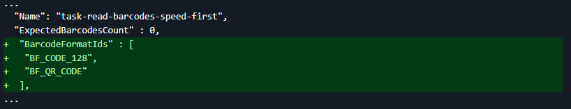
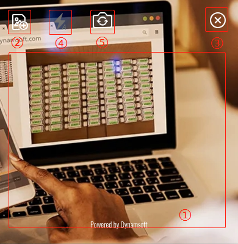
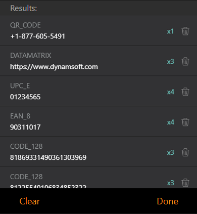

# Customize Your BarcodeScanner

- [Specify the barcode format](#specify-the-barcode-format)
- [Use customized template](#use-customized-template)
- [Config the pre-built UIs](#config-the-pre-built-uis)
- [Use BarcodeScanner in frameworks](#use-barcodescanner-in-frameworks)

## Specify the barcode format

Specifying the target barcode formats not only speeds up the recognition process but also improves accuracy. This is one of the most common customization needs. BarcodeScanner provides two ways to specify the barcode formats. For example, if your target formats are `QR_CODE` and `CODE_128`:

> [!NOTE]
> See [all supported barcode formats](https://dynamsoft.com/barcode-reader/barcode-types/).

### Option 1: Set via BarcodeScannerConfig

Add the following configuration in [`BarcodeScannerConfig`]({{ site.js_api }}barcode-scanner.html#barcodescannerconfig):

```js
const barcodeScanner = new Dynamsoft.BarcodeScanner({
  // ...
  barcodeFormats:[Dynamsoft.DBR.EnumBarcodeFormat.BF_QR_CODE , Dynamsoft.DBR.EnumBarcodeFormat.BF_CODE_128],
  // ...
});
```

### Option 2: Specify in a template file

The benefit of this approach is that the template file can be reused across different platforms or programming languages, ensuring performance consistency across scenarios. To do this, follow these steps:

1. Open `dist\DBR-PresetTemplates.json` in your code editor. This file contains all the preset templates related to barcode reading.

2. Add the `BarcodeFormatIds` to the `BarcodeReaderTaskSettingOptions` object.

3. Update `BarcodeFormatIds` as shown below. You can get barcode format strings [here](https://www.dynamsoft.com/capture-vision/docs/core/enums/barcode-reader/barcode-format.html).



Refer to [`Use customized template`](#use-customized-template) for more details.

> [!IMPORTANT]
> Due to the powerful customization capabilities, the number of configurable parameters in the templates is extensive and relatively complex. feel free to [contact us](https://www.dynamsoft.com/contact/) if you need help creating a custom template.

## Use customized template

In more complex scenarios—such as blurred, damaged, curved, or unevenly lit barcodes—you might need a custom template to perform specific image processing steps. BarcodeScannerConfig provides a property to load a template file, allowing you to customize the algorithm’s processing workflow.

> [!WARNING]
> This operation will overwrite the built-in templates.

```js
  const barcodeScannerConfig = {
    // The path to your custom JSON template that defines the scanning process.
    templateFilePath:'path/to/DBR-PresetTemplates.json'
    };
  // Initialize the BarcodeScanner with the above BarcodeScannerConfig object
  const barcodeScanner = new Dynamsoft.BarcodeScanner(barcodeScannerConfig);
```

## Config the Pre-built UIs

The built-in UI of `BarcodeScanner` is composed of `BarcodeScannerView` and `BarcodeResultView`. In `MULTI_UNIQUE` mode, `BarcodeResultView` is shown by default to ensure the essential workflow can proceed. Other UI components can be shown or hidden manually through `barcodeScannerConfig`. Let's break down these two Views:

### BarcodeScannerView

The `BarcodeScannerView` is composed of the following UI elements:



1. **Camera View**: The Camera View is the camera viewfinder UI component within the `BarcodeScannerView`. This viewfinder occupies the majority of the space within the `BarcodeScannerView` to give the user a clear view and precise control of the image being scanned.

2. **Load Image Button**: This button allows the user to scan a file of a barcode-containing image from the device's local storage. You can decide whether to show or hide the button by [showUploadImageButton]({{ site.js_api }}barcode-scanner.html#barcodescannerconfig) property.

3. **Close Scanner Button**: This button closes the Barcode Scanner, return a [`BarcodeScanResult`]({{ site.js_api }}barcode-scanner.html#barcodescanresult) object and destroys the **`BarcodeScanner`** instance. You can decide whether to show or hide the button by [showCloseButton]({{ site.js_api }}barcode-scanner.html#scannerviewconfig) property.

4. **Flash Button**: This button allows the user to toggle the camera's torch. You can decide whether to show or hide the button by [showFlashButton]({{ site.js_api }}barcode-scanner.html#barcodescannerconfig) property.

5. **Camera Switch Button**: This button allows the users to change between cameras. You can specify the mode and visibility of the camera switch control by [cameraSwitchControl]({{ site.js_api }}barcode-scanner.html#scannerviewconfig) property.

### BarcodeResultView (MULTI_UNIQUE mode only)

Here is a quick breakdown of the `MULTI_UNIQUE` UI elements of the `BarcodeResultView` view:



1. **Barcode Results List**: The list used to display the decoding results.The list is updated whenever a new barcode is successfully decoded, or the same code is detected again after a specific [duplicateForgetTime]({{ site.js_api }}barcode-scanner.html#barcodescannerconfig).

2. **Clear Button**: The button on the bottom left, which clears all elements of the current `Barcode Results List`. You can change the style of the Button with [BarcodeResultViewToolbarButtonsConfig]({{ site.js_api }}barcode-scanner.html#barcoderesultviewtoolbarbuttonsconfig).

3. **Done Button**: The button on the bottom right, which closes the Barcode Scanner, return a [`BarcodeScanResult`]({{ site.js_api }}barcode-scanner.html#barcodescanresult) object that includes all unique barcodes and destroys the **`BarcodeScanner`** instance. You can change the style of the Button with [BarcodeResultViewToolbarButtonsConfig]({{ site.js_api }}barcode-scanner.html#barcoderesultviewtoolbarbuttonsconfig).

### Manually modify the UI file

Another way to fully customize the UI is by directly editing the `.xml` file. In the `dist/` directory, you'll find the `barcode-scanner.ui.xml` file, which is the default UI for the `BarcodeScanner`. 

> [!NOTE]
> Although it is essentially HTML, using a .xml extension can help prevent compatibility issues with the Live Server plugin.

You can make a copy of it and apply your own modifications. For example, to double the size of the `UploadImage` icon, you can edit the file like this:

```xml
<template>
<!-- ... -->
    <!-- <svg id="upload-image" xmlns="http://www.w3.org/2000/svg" xmlns:xlink="http://www.w3.org/1999/xlink" width="24" height="24" viewBox="0 0 26 26"> -->
    <svg id="upload-image" xmlns="http://www.w3.org/2000/svg" xmlns:xlink="http://www.w3.org/1999/xlink" width="48" height="48" viewBox="0 0 26 26">
<!-- ... -->        
</template>
```

Once you've made your changes, just set the new `uiPath` in the configuration. If everything is configured correctly, the updated UI will appear the next time you refresh the page.

```js
    const barcodeScanner = new Dynamsoft.BarcodeScanner({
      //...
      uiPath: "path/to/new-barcode-scanner.ui.xml?v=<your-update-version>",
      //...
    });
```

## Use BarcodeScanner in frameworks

Integrating `BarcodeScanner` into frameworks like `Angular`, `React`, and `Vue` is a little different compared to native usage. You can also refer to [the ready-made samples for popular frameworks](https://github.com/Dynamsoft/barcode-reader-javascript-samples/tree/main/barcode-scanner-api-samples/scan-single-barcode) directly without reading this guide.

### Installation

Open the terminal from your project root and install **Dynamsoft Barcode Reader SDK** with the following command:

```sh
npm install dynamsoft-barcode-reader-bundle@11.0.6000 -E
```

### Component for video decoding

Here’s how to quickly set up a video barcode scanner using the `BarcodeScanner` class:

```ts
    const config = {
      license: "YOUR-LICENSE-KEY",  // Replace with your license key
    }
    const barcodeScanner = new BarcodeScanner(config);
    barcodeScanner.launch().then((result)=>{
      console.log(result); // Handle the decoding result here
    });
```

#### Define the resource paths

To ensure stability, especially in environments with limited internet access, it’s a good idea to **host all required resources locally** (e.g., under the dist/ folder).
Below is an example using the official CDN — feel free to replace it with your own path:

```ts
    const config = {
      license: "YOUR-LICENSE-KEY",
      // Configures the paths where the .wasm files and other necessary resources for modules are located.
      engineResourcePaths: {
        // Using jsDelivr CDN as an example
        rootDirectory: "https://cdn.jsdelivr.net/npm/dynamsoft-barcode-reader-bundle@11.0.6000/dist/",
      },
      // Path to the UI (.xml template file).
      uiPath: "https://cdn.jsdelivr.net/npm/dynamsoft-barcode-reader-bundle@11.0.6000/dist/barcode-scanner.ui.xml",
    };
```

#### Set up the video container

Specify the container where the scanner UI should be rendered:

```ts
    const config = {
      container: ".barcode-scanner-view", // CSS selector for the scanner container
    };
```

Make sure your HTML includes the corresponding element:

```html
<div class="barcode-scanner-view"></div>
```

The above steps cover the key considerations when using the `BarcodeScanner` component within a modern JavaScript framework. To recap:

- Install the SDK with an exact version to avoid compatibility issues.

- Define resource paths explicitly — either via CDN or local dist/ folder — to ensure consistent loading behavior.

- Configure and launch the scanner using the provided component API.

- Set up a container element to properly display the scanner UI.

By following these best practices, you'll ensure a stable and reliable integration of `BarcodeScanner` into your application.